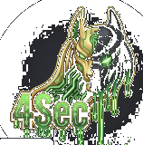

# 🪐 n0t381x // Operational Note Filter (Cyberpunk Edition)

<p align="center">
  
</p>

**n0t381x** is a lightweight, high-speed neural parser and browser extension/bookmarklet designed specifically for offensive security operations, penetration testers, and CTF/exam architectures (OSCP, HTB). It automatically ingests text data from active browser tabs, filters out non-operational fluff, and outputs clean, structured, Obsidian-ready Markdown.

---

## ⚡ Main Directives & Bookmarklet Controls

### 1. Browser Extension Usage
1. Start your local LLM server (`llama-server`) with recommended settings.
2. Navigate to your target page (e.g., HackTheBox Academy, OffSec lab text).
3. Click the **Note81x** extension icon in your toolbar.
4. Click the **Scan & Format Notes** button.
5. The structured Markdown results will appear in the output area. Click **Copy to Obsidian** to copy to clipboard.

### 2. Bookmarklets (Desktop & Mobile v2)
For environments where browser extensions cannot be installed (such as mobile browsers or restricted environments), **n0t381x** can be run as a bookmarklet. Bookmarklets execute directly in the context of the active tab, parse the page text, send it to the LLM API, and copy the Markdown straight to your clipboard.

*   **Desktop Bookmarklet (Local HTTP)**: 
    *   **Source Code:** [`src/desktop.js`](file:///mnt/0xJackal/workspace/richie_2.0/n0t381x/src/desktop.js)
    *   **API Endpoint:** `http://127.0.0.1:8080/v1/chat/completions`
    *   **HTTPS Bypass (Mixed Content):** Modern browsers block HTTP requests from HTTPS sites. To run the desktop bookmarklet on HTTPS sites, you must enable insecure content in your browser's site settings for that target domain (Click the lock/settings icon next to the URL -> Site Settings -> Allow "Insecure content").
*   **Mobile v2 Bookmarklet (Localtunnel / HTTPS)**:
    *   **Source Code:** [`src/mobile.v2.js`](file:///mnt/0xJackal/workspace/richie_2.0/n0t381x/src/mobile.v2.js)
    *   **API Endpoint:** Localtunnel URL (e.g., `https://honest-forks-refuse.loca.lt/v1/chat/completions`)
    *   **iOS/Webkit Compatibility:** Runs silently (no blocking `alert()` calls) to prevent iOS WebKit from blocking the script.

#### Localtunnel Workflow & Setup
1. **Start the Tunnel:** On the machine running your local LLM (listening on port 8080), expose it via HTTPS using localtunnel:
   ```bash
   npx localtunnel --port 8080
   ```
2. **Bypass Interstitial:** Navigate to the provided `https://xxxx.loca.lt` URL in your mobile browser once and click **"Click to continue"** to bypass the interstitial screen.
3. **Bypass-Tunnel-Reminder Header:** The mobile v2 bookmarklet automatically includes the `'Bypass-Tunnel-Reminder': 'true'` header in fetch requests to prevent API requests from getting blocked by the reminder screen.
4. **Update Endpoint:** If your localtunnel session restarts and changes its URL, update the `API_URL` constant in [`src/mobile.v2.js`](file:///mnt/0xJackal/workspace/richie_2.0/n0t381x/src/mobile.v2.js) and run the build script.

---

## 🛠️ Installed Subsystems & Features

### 1. Key Capabilities
*   **3-Point Operational Filter:** Strict extraction focusing only on what matters:
    *   **Indicators (Where):** File extensions, vulnerable headers, URL paths, ports, etc.
    *   **Execution & Syntax (How):** Exact commands, payloads, and tool invocation syntaxes.
    *   **Bypasses (What If):** Evasion techniques and alternative payloads.
*   **Fluff & Theory Removal:** Discards background history, GUI setup steps, and theoretical explanations.
*   **Auto-Generated Cheatsheet:** Collects all payloads, commands, and script syntaxes into a clean, raw code block at the bottom.
*   **One-Click Obsidian Export:** Instantly copy formatted notes to your clipboard.

### 2. Browser Compatibility
| Browser | Engine | Installation Method |
| :--- | :--- | :--- |
| **Google Chrome** | Chromium | Load Unpacked Extension |
| **Brave** | Chromium | Load Unpacked Extension |
| **Microsoft Edge** | Chromium | Load Unpacked Extension |
| **Opera** | Chromium | Load Unpacked Extension |
| **Vivaldi** | Chromium | Load Unpacked Extension |
| **Mozilla Firefox** | Gecko | Load Temporary Add-on (via `about:debugging`) |

### 3. Project Structure
```text
n0t381x/
├── src/
│   ├── desktop.js                  # Desktop bookmarklet logic (local loopback)
│   ├── desktop.bookmarklet.txt     # Compiled desktop bookmarklet payload
│   ├── mobile.v2.js                # Mobile bookmarklet logic (localtunnel endpoint)
│   └── mobile.v2.bookmarklet.txt   # Compiled mobile bookmarklet payload
├── scripts/
│   └── build.js                    # Simple build script to URL-encode JS files to bookmarklet strings
├── manifest.json                   # Extension configuration (Manifest V3)
├── popup.html                      # UI structure of the extension popup
├── popup.js                        # Extension scripting, text scraping, and API interaction logic
├── .gitignore                      # Git ignore file
└── README.md                       # Project documentation
```

---

## 🧪 Installation Guide & Uplink Protocols

### 1. Prerequisites (Local LLM Integration)
Note81x operates completely locally to keep your exam data private. By default, it expects a local API server running on port `8080`.
1. **Download the Model:** We recommend using **DeepSeek-Coder-V2-Lite-Instruct (Q4_K_M)** or similar models. Download the GGUF file from Hugging Face.
2. **Start the LLM Server (via `llama.cpp`):**
   ```bash
   llama-server \
     -m /path/to/DeepSeek-Coder-V2-Lite-Instruct-Q4_K_M.gguf \
     -c 4096 \
     --port 8080 \
     --host 127.0.0.1
   ```

### 2. Browser Extension Installation
*   **For Chromium-Based Browsers:**
    1. Clone or download this repository: `git clone https://github.com/4nu81x/n0t381x.git`
    2. Open your browser and navigate to the Extensions page (e.g. `chrome://extensions/`).
    3. Toggle the **Developer mode** switch to **ON**.
    4. Click **Load unpacked** and select the `n0t381x` directory.
*   **For Mozilla Firefox:**
    1. Open Firefox and type `about:debugging` in the address bar.
    2. Click on **This Firefox** in the left sidebar.
    3. Click the **Load Temporary Add-on...** button.
    4. Select the `manifest.json` file inside the `n0t381x` folder.

### 3. Building Bookmarklets
To encode the Javascript source files into bookmarklet strings:
1. Run the build script:
   ```bash
   node scripts/build.js
   ```
2. The generated bookmarklet payloads will be written to `src/desktop.bookmarklet.txt` and `src/mobile.v2.bookmarklet.txt`.
3. Create a new bookmark in your browser, and paste the entire content of the `.txt` file into the URL/Address field of the bookmark.
